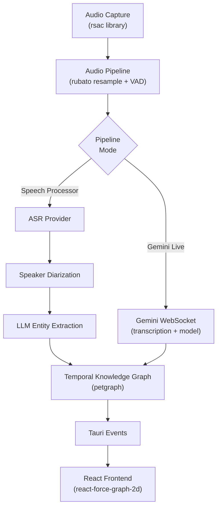
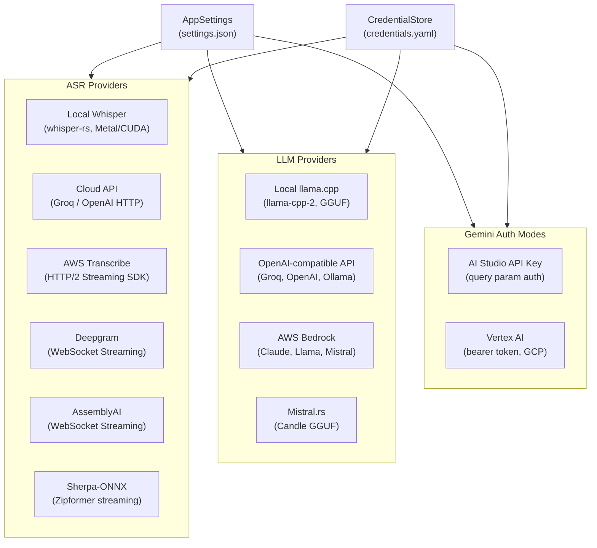
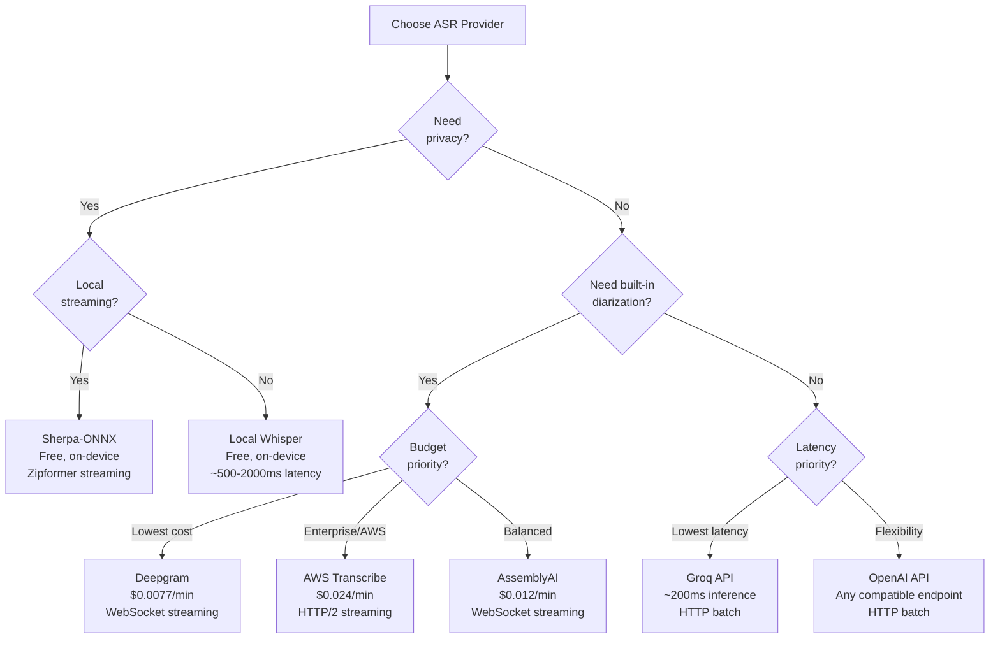
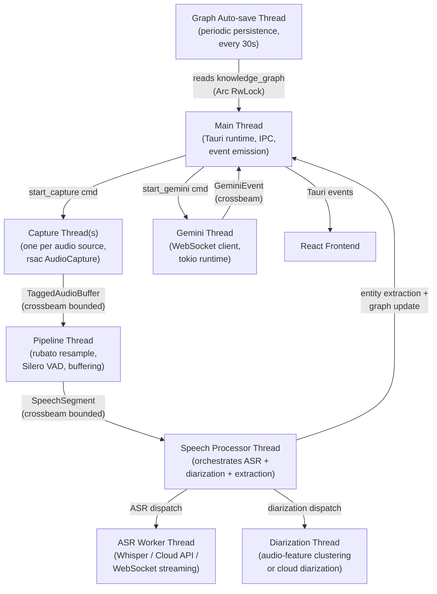
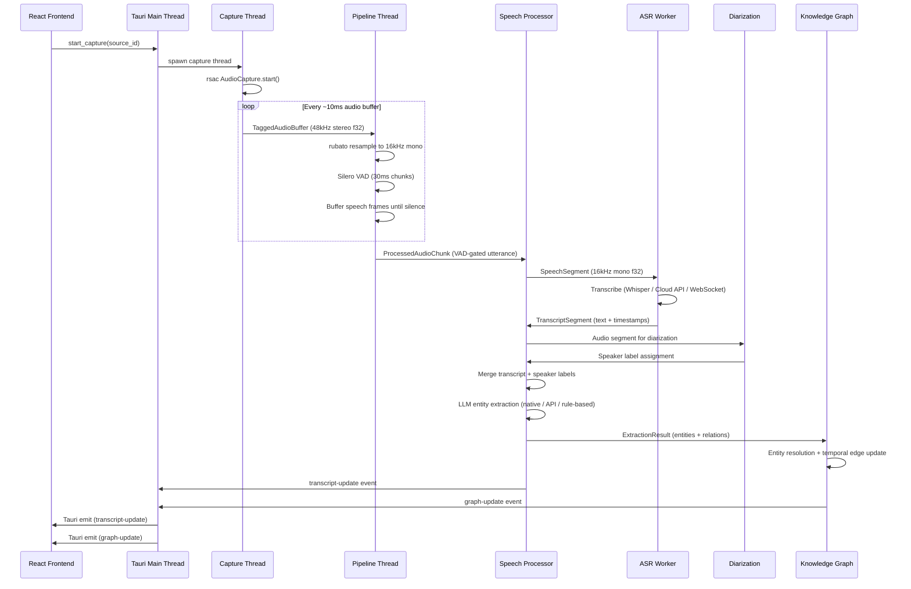
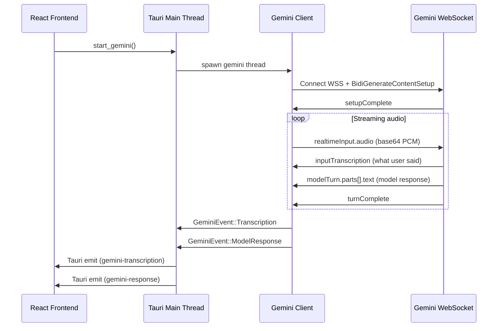
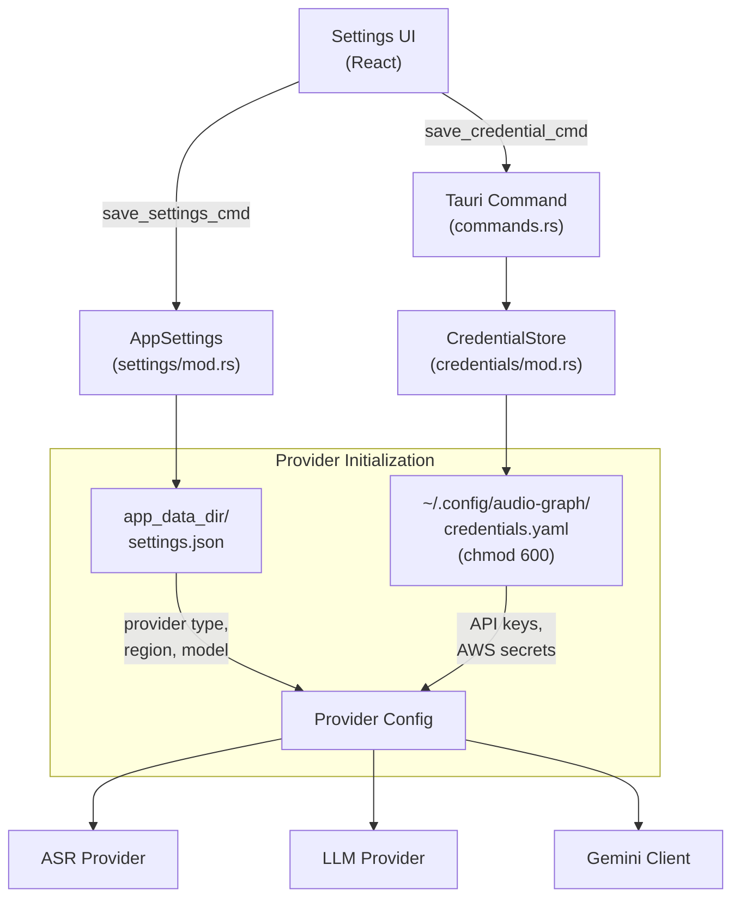
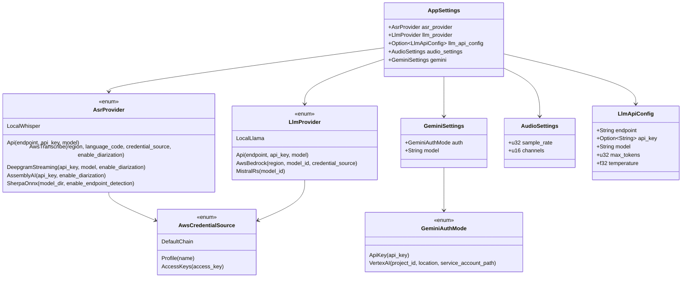

# AudioGraph -- Architecture Document

> **Source of truth** for the AudioGraph Tauri desktop application.
> Last updated: 2026-04-16.

---

## Table of Contents

1. [Vision and Philosophy](#1-vision-and-philosophy)
2. [System Architecture](#2-system-architecture)
3. [Provider Architecture](#3-provider-architecture)
4. [Threading Model](#4-threading-model)
5. [Data Flow](#5-data-flow)
6. [Credential Management](#6-credential-management)
7. [Settings and Configuration](#7-settings-and-configuration)
8. [Module Structure](#8-module-structure)
9. [Dependencies](#9-dependencies)
10. [Build and Run Instructions](#10-build-and-run-instructions)
11. [Testing Each Provider](#11-testing-each-provider)

---

## 1. Vision and Philosophy

AudioGraph captures live audio, transcribes it through configurable ASR providers, extracts entities via configurable LLM providers, and builds a real-time temporal knowledge graph. The core philosophy: **every pipeline stage has local AND cloud alternatives**, letting users choose based on their hardware, budget, and privacy requirements.

### Core Capabilities

| Capability | Description |
|---|---|
| **Multi-source audio capture** | Capture system audio, per-application audio, or process-tree audio via rsac |
| **Voice Activity Detection** | Silero VAD v5 filters silence, gating audio chunks to ASR |
| **Configurable ASR** | 5 providers: local Whisper, Groq/OpenAI API, AWS Transcribe, Deepgram, AssemblyAI |
| **Configurable LLM** | 3 providers: local llama.cpp, OpenAI-compatible API, AWS Bedrock |
| **Speaker Diarization** | Audio-feature clustering (MVP) with cloud diarization via Deepgram/AssemblyAI/AWS |
| **Gemini Live** | Streaming transcription + model responses via Google Gemini (API Key or Vertex AI) |
| **Temporal Knowledge Graph** | petgraph-based in-memory graph with temporal edges, entity resolution, and live mutation |
| **Live Visualization** | react-force-graph-2d rendering with streaming Tauri event updates |
| **Persistence** | File-based auto-save of transcripts and knowledge graph per session |

### Design Principles

1. **Provider-agnostic pipeline** -- Every stage accepts a provider enum; swap providers without touching pipeline code.
2. **Local-first, cloud-optional** -- The app works fully offline with local Whisper + llama.cpp. Cloud providers are opt-in.
3. **Credential isolation** -- API keys live in `~/.config/audio-graph/credentials.yaml` (chmod 600 on Unix), never in settings.json.
4. **Thread-per-stage** -- Each pipeline stage runs on a dedicated thread, communicating via bounded crossbeam channels.
5. **Graceful degradation** -- Missing models or failed providers fall through to the next available backend.

### Cross-Platform Support

| Platform | Audio Backend | Status |
|---|---|---|
| **Linux** | PipeWire via rsac | Supported |
| **macOS** | CoreAudio Process Tap via rsac | Supported (macOS 14.4+) |
| **Windows** | WASAPI Process Loopback via rsac | Supported |

---

## 2. System Architecture

### System Overview



### Pipeline Modes

AudioGraph supports two distinct pipeline modes:

1. **Speech Processor** -- The modular pipeline where each stage (ASR, diarization, extraction) uses independently configured providers. This is the primary mode.
2. **Gemini Live** -- A streaming WebSocket pipeline where Google Gemini handles transcription, model responses, and (optionally) entity extraction in a single connection.

Both modes feed results into the same temporal knowledge graph and React frontend.

### Monorepo Placement

```
rust-crossplat-audio-capture/    # Workspace root
+-- Cargo.toml                   # Workspace members includes apps/audio-graph/src-tauri
+-- src/                         # rsac library crate
+-- apps/
    +-- audio-graph/             # AudioGraph Tauri application
        +-- src-tauri/           # Rust backend (workspace member)
        +-- src/                 # React frontend
        +-- docs/                # Architecture and design docs
```

---

## 3. Provider Architecture

### Provider Overview Diagram



### All Providers Reference Table

| Provider | Category | Type | Protocol | Streaming | Diarization | Cost | Privacy |
|---|---|---|---|---|---|---|---|
| **Local Whisper** | ASR | Local | whisper-rs (C++ FFI) | No (batch) | No (separate stage) | Free | Full (on-device) |
| **Groq / OpenAI API** | ASR | Cloud | HTTP multipart POST | No (batch) | No | Per-minute | Data sent to cloud |
| **AWS Transcribe** | ASR | Cloud | HTTP/2 (AWS SDK) | Yes (streaming) | Yes (built-in) | $0.024/min | AWS data policies |
| **Deepgram** | ASR | Cloud | WebSocket | Yes (streaming) | Yes (built-in) | $0.0077/min | Deepgram data policies |
| **AssemblyAI** | ASR | Cloud | WebSocket | Yes (streaming) | Yes (built-in) | $0.012/min | AssemblyAI data policies |
| **Sherpa-ONNX** | ASR | Local | ONNX Zipformer | Yes (streaming) | No (separate) | Free | Full (on-device) |
| **Local llama.cpp** | LLM | Local | In-process (GGUF) | No | N/A | Free | Full (on-device) |
| **OpenAI-compatible API** | LLM | Cloud | HTTP JSON | No | N/A | Per-token | Varies by provider |
| **AWS Bedrock** | LLM | Cloud | HTTP (AWS SDK) | No | N/A | Per-token | AWS data policies |
| **Mistral.rs** | LLM | Local | In-process GGUF (Candle) | N/A | N/A | Free | Full (on-device) |
| **Gemini (API Key)** | Full Pipeline | Cloud | WebSocket | Yes | N/A | Per-token | Google data policies |
| **Gemini (Vertex AI)** | Full Pipeline | Cloud | WebSocket | Yes | N/A | Per-token | GCP data policies |

### ASR Provider Decision Tree



### ASR Provider Details

#### Local Whisper (`AsrProvider::LocalWhisper`)

- **Engine:** whisper-rs (Rust bindings to whisper.cpp)
- **Model:** `ggml-small.en.bin` (~466 MB), loaded once at startup
- **GPU:** Metal (macOS auto), CUDA/Vulkan (opt-in features)
- **Latency:** 300-2000ms depending on utterance length and hardware
- **Credentials:** None required

#### Cloud API (`AsrProvider::Api`)

- **Protocol:** HTTP multipart POST to `/v1/audio/transcriptions`
- **Compatible with:** Groq, OpenAI, any Whisper-compatible endpoint
- **Settings:** `endpoint`, `api_key`, `model`
- **Latency:** ~200-3000ms plus 2s audio accumulation
- **Implementation:** `asr/cloud.rs`

#### AWS Transcribe (`AsrProvider::AwsTranscribe`)

- **Protocol:** HTTP/2 event stream via AWS SDK
- **Settings:** `region`, `language_code`, `credential_source`, `enable_diarization`
- **Built-in diarization:** Yes (speaker labels in transcript results)
- **Implementation:** `asr/aws_transcribe.rs`

#### Deepgram (`AsrProvider::DeepgramStreaming`)

- **Protocol:** WebSocket to `wss://api.deepgram.com/v1/listen`
- **Settings:** `api_key`, `model` (default: `nova-3`), `enable_diarization`
- **Built-in diarization:** Yes
- **Implementation:** `asr/deepgram.rs`

#### AssemblyAI (`AsrProvider::AssemblyAI`)

- **Protocol:** WebSocket to AssemblyAI real-time transcription
- **Settings:** `api_key`, `enable_diarization`
- **Built-in diarization:** Yes
- **Implementation:** `asr/assemblyai.rs`

### LLM Provider Details

#### Local llama.cpp (`LlmProvider::LocalLlama`)

- **Engine:** llama-cpp-2 (Rust bindings to llama.cpp)
- **Model:** Any GGUF file (default: `lfm2-350m-extract-q4_k_m.gguf`)
- **Entity extraction:** GBNF grammar-constrained JSON output
- **Chat:** Free-form generation with graph context
- **GPU:** Metal (macOS auto), CUDA/Vulkan (opt-in)

#### OpenAI-compatible API (`LlmProvider::Api`)

- **Protocol:** HTTP JSON POST to `/v1/chat/completions`
- **Compatible with:** OpenAI, Groq, Ollama, LM Studio, vLLM, Together AI, OpenRouter
- **Settings:** `endpoint`, `api_key`, `model`
- **Default:** `http://localhost:11434/v1` (Ollama) with model `llama3.2`

#### AWS Bedrock (`LlmProvider::AwsBedrock`)

- **Protocol:** HTTP via AWS SDK
- **Settings:** `region`, `model_id`, `credential_source`
- **Available models:** Claude, Llama, Mistral via Bedrock
- **Shares credentials** with AWS Transcribe

### Gemini Live Details

#### API Key Mode (`GeminiAuthMode::ApiKey`)

- **Auth:** API key in WebSocket URL query parameter
- **Endpoint:** `wss://generativelanguage.googleapis.com/...?key=API_KEY`
- **Use case:** Developer/consumer, quick setup

#### Vertex AI Mode (`GeminiAuthMode::VertexAI`)

- **Auth:** Bearer token in WebSocket headers (via `gcp_auth`)
- **Settings:** `project_id`, `location`, optional `service_account_path`
- **Endpoint:** `wss://{location}-aiplatform.googleapis.com/...`
- **Use case:** Enterprise GCP deployments
- **Token refresh:** Automatic via `gcp_auth` crate (ADC or service account)

### Extraction Chain (Fallback Order)

The entity extraction chain uses a priority order based on the configured LLM provider:

```
LlmProvider::LocalLlama:
  native LLM --> API client --> rule-based NER

LlmProvider::Api or LlmProvider::AwsBedrock:
  API client --> native LLM --> rule-based NER
```

The rule-based extractor (`graph/extraction.rs`) is always available as a final fallback using regex-based NER patterns.

---

## 4. Threading Model

### Thread Architecture Diagram



### Thread Inventory

| Thread | Responsibility | Input | Output |
|---|---|---|---|
| **main (Tauri)** | Runtime, commands, event emission | IPC commands | Tauri events to frontend |
| **capture-{id}** | Owns one rsac AudioCapture | Ring buffer reads | TaggedAudioBuffer via crossbeam |
| **audio-pipeline** | Resample 48kHz to 16kHz, VAD, speech buffering | TaggedAudioBuffer | ProcessedAudioChunk via crossbeam |
| **speech-processor** | Orchestrates ASR + diarization + extraction | ProcessedAudioChunk | TranscriptSegment, GraphSnapshot events |
| **asr-worker** | Whisper inference (or cloud dispatch) | SpeechSegment | TranscriptSegment via crossbeam |
| **diarization** | Speaker identification | Audio segments | Speaker labels via crossbeam |
| **gemini-client** | WebSocket streaming to Gemini | Audio PCM chunks | GeminiEvent via crossbeam |
| **graph-autosave** | Periodic persistence (every 30s) | Arc<RwLock<TemporalKnowledgeGraph>> | JSON files to disk |

### Channel Communication

All inter-thread communication uses `crossbeam-channel` bounded channels to provide backpressure and prevent unbounded memory growth. The speech processor thread acts as the central orchestrator, dispatching work to ASR and diarization sub-workers and collecting results for entity extraction and graph updates.

---

## 5. Data Flow

### Full Pipeline Sequence



### Gemini Live Pipeline



### Tauri Events

| Event | Payload | Trigger |
|---|---|---|
| `transcript-update` | `TranscriptSegment` | New transcript segment available |
| `graph-update` | `GraphSnapshot` | Knowledge graph changed (full snapshot, throttled) |
| `graph-delta` | Delta update | Incremental graph change (every extraction cycle) |
| `pipeline-status` | `PipelineStatus` | Pipeline stage status change |
| `speaker-detected` | Speaker info | New speaker identified |
| `capture-error` | Error payload | Capture or processing error |
| `gemini-transcription` | Transcription text | Gemini Live input transcription |
| `gemini-response` | Model text | Gemini Live model response |
| `gemini-status` | Connection status | Gemini Live connection state change |

---

## 6. Credential Management

### Credential Flow Diagram



### CredentialStore Fields

The credential store (`~/.config/audio-graph/credentials.yaml`) holds these optional fields:

| Field | Provider | Purpose |
|---|---|---|
| `openai_api_key` | OpenAI / Groq API (ASR + LLM) | HTTP Authorization header |
| `groq_api_key` | Groq API | HTTP Authorization header |
| `deepgram_api_key` | Deepgram | WebSocket Authorization header |
| `gemini_api_key` | Gemini (API Key mode) | WebSocket URL query param |
| `assemblyai_api_key` | AssemblyAI | WebSocket Authorization header |
| `aws_access_key` | AWS (Transcribe + Bedrock) | AWS SigV4 signing |
| `aws_secret_key` | AWS (Transcribe + Bedrock) | AWS SigV4 signing |
| `aws_session_token` | AWS (temporary credentials) | AWS SigV4 signing |
| `google_service_account_path` | Gemini (Vertex AI mode) | Path to GCP service account JSON |
| `together_api_key` | Together AI API | HTTP Authorization header |
| `fireworks_api_key` | Fireworks AI API | HTTP Authorization header |
| `aws_profile` | AWS (named profile) | AWS profile name for credential resolution |
| `aws_region` | AWS (Transcribe + Bedrock) | AWS region override |

### Credential Operations

```
save_credential_cmd(key, value)   -- Upserts a credential and writes the YAML file
load_credential_cmd(key)          -- Returns a single credential value (or null)
load_all_credentials_cmd()        -- Returns the entire CredentialStore
list_aws_profiles()               -- Parses ~/.aws/config and returns profile names
```

### Security Measures

- YAML file has `chmod 600` on Unix (owner read/write only)
- Atomic writes via temp file + rename to prevent corruption
- API keys are never written to `settings.json` (only non-sensitive settings like region, model, endpoint URL)
- AWS credentials support three modes: DefaultChain (env/profile), Profile (named), AccessKeys (manual)

---

## 7. Settings and Configuration

### Settings Type Hierarchy



### Settings Storage

- **Location:** `{app_data_dir}/settings.json` (Tauri standard app data directory)
- **Format:** JSON with serde tagged enums (`"type": "local_whisper"`, etc.)
- **Load behavior:** Missing or unparseable files fall back to `AppSettings::default()`
- **Save behavior:** Atomic write via temp file + rename

### Default Values

| Setting | Default |
|---|---|
| ASR provider | `LocalWhisper` |
| LLM provider | `Api { endpoint: "http://localhost:11434/v1", model: "llama3.2" }` |
| Audio sample rate | 16000 Hz |
| Audio channels | 1 (mono) |
| Gemini auth | `ApiKey { api_key: "" }` |
| Gemini model | `gemini-3.1-flash-live-preview` |
| AWS region | `us-east-1` |
| Language code | `en-US` |
| Deepgram model | `nova-3` |
| LLM max tokens | 2048 |
| LLM temperature | 0.7 |

---

## 8. Module Structure

```
apps/audio-graph/
+-- docs/
|   +-- ARCHITECTURE.md              # This document
|   +-- designs/
|       +-- provider-architecture.md  # Provider design decisions
+-- models/                           # ML models (gitignored)
+-- scripts/
|   +-- download-models.sh           # Model download (Linux/macOS)
|   +-- download-models.ps1          # Model download (Windows)
+-- src-tauri/                        # Rust backend
|   +-- Cargo.toml                   # Rust dependencies
|   +-- tauri.conf.json              # Tauri v2 configuration
|   +-- build.rs                     # Tauri build script
|   +-- capabilities/
|   |   +-- default.json             # Tauri v2 permissions
|   +-- src/
|       +-- main.rs                  # Tauri entry point
|       +-- lib.rs                   # Module declarations + app setup
|       +-- state.rs                 # AppState (Arc<Mutex/RwLock> shared state)
|       +-- commands.rs              # Tauri IPC command handlers
|       +-- events.rs                # Event name constants + payload types
|       +-- settings/
|       |   +-- mod.rs               # AppSettings, AsrProvider, LlmProvider,
|       |                              GeminiSettings, AudioSettings enums
|       +-- credentials/
|       |   +-- mod.rs               # CredentialStore (YAML-based key storage)
|       +-- audio/
|       |   +-- mod.rs               # Audio module root
|       |   +-- capture.rs           # rsac AudioCapture wrapper
|       |   +-- pipeline.rs          # Resample (rubato) + VAD (Silero) + buffering
|       +-- asr/
|       |   +-- mod.rs               # AsrWorker (local Whisper), AsrConfig
|       |   +-- cloud.rs             # CloudAsrConfig, HTTP multipart ASR
|       |   +-- aws_transcribe.rs    # AWS Transcribe HTTP/2 streaming
|       |   +-- deepgram.rs          # Deepgram WebSocket streaming
|       |   +-- assemblyai.rs        # AssemblyAI WebSocket streaming
|       +-- speech/
|       |   +-- mod.rs               # Speech processor orchestrator
|       |                              (ASR + diarization + extraction dispatch)
|       +-- diarization/
|       |   +-- mod.rs               # Speaker diarization (audio features MVP)
|       +-- llm/
|       |   +-- mod.rs               # LLM module root
|       |   +-- engine.rs            # Native llama.cpp inference (GGUF, GBNF grammar)
|       |   +-- api_client.rs        # OpenAI-compatible HTTP API client
|       +-- gemini/
|       |   +-- mod.rs               # Gemini Live WebSocket client
|       |                              (BidiGenerateContent, API Key + Vertex AI)
|       +-- graph/
|       |   +-- mod.rs               # Graph module root
|       |   +-- entities.rs          # Entity and relation type definitions
|       |   +-- extraction.rs        # Rule-based entity extraction (regex NER)
|       |   +-- temporal.rs          # TemporalKnowledgeGraph (petgraph wrapper)
|       +-- models/
|       |   +-- mod.rs               # Model management + download commands
|       +-- persistence/
|           +-- mod.rs               # File-based save/load, graph auto-save thread
+-- src/                              # React frontend
|   +-- main.tsx                     # React entry point
|   +-- App.tsx                      # Root component + Tauri event listeners
|   +-- App.css                      # Application styles (dark theme)
|   +-- styles.css                   # Global styles
|   +-- components/
|   |   +-- AudioSourceSelector.tsx  # Audio source dropdown
|   |   +-- ChatSidebar.tsx          # Chat sidebar (LLM Q&A)
|   |   +-- ControlBar.tsx           # Start/stop controls
|   |   +-- KnowledgeGraphViewer.tsx # Force-directed graph visualization
|   |   +-- LiveTranscript.tsx       # Scrolling transcript with speakers
|   |   +-- PipelineStatusBar.tsx    # Pipeline stage monitor
|   |   +-- SettingsPanel.tsx        # Provider and credential settings
|   |   +-- SpeakerPanel.tsx         # Speaker list
|   +-- hooks/
|   |   +-- useTauriEvents.ts        # Tauri event subscriptions
|   +-- store/
|   |   +-- index.ts                 # Zustand state store
|   +-- types/
|   |   +-- index.ts                 # TypeScript type definitions
|   +-- utils/
+-- package.json                      # Frontend dependencies (bun)
+-- tsconfig.json                     # TypeScript config
+-- vite.config.ts                    # Vite config (Tauri plugin)
+-- index.html                        # Vite entry point
```

---

## 9. Dependencies

### Rust Crate Dependencies

#### Core Framework

| Crate | Version | Purpose |
|---|---|---|
| `tauri` | 2.10 | Application framework |
| `rsac` | path dep | Audio capture library |
| `serde` / `serde_json` | 1.0 | Serialization |
| `serde_yaml` | 0.9 | Credential store format |
| `tokio` | 1.50 | Async runtime (for WebSocket providers) |
| `crossbeam-channel` | 0.5 | Inter-thread communication |
| `log` / `env_logger` | 0.4 / 0.11 | Logging |
| `uuid` | 1.22 | UUID generation |
| `dirs` | 6 | Platform config directory resolution |

#### Audio Processing

| Crate | Version | Purpose |
|---|---|---|
| `rubato` | 2.0 | Audio resampling (48kHz to 16kHz) |
| `audioadapter-buffers` | 3.0 | Audio buffer utilities |

#### ASR

| Crate | Version | Purpose |
|---|---|---|
| `whisper-rs` | 0.16 | Local Whisper ASR (whisper.cpp bindings) |
| `reqwest` | 0.13 | HTTP client (cloud ASR API, multipart uploads) |

#### AWS Integration

| Crate | Version | Purpose |
|---|---|---|
| `aws-config` | 1.1 | AWS credential resolution (SSO, profiles, env) |
| `aws-sdk-transcribestreaming` | 1.102 | AWS Transcribe HTTP/2 streaming |
| `aws-credential-types` | 1 | AWS credential types |
| `aws-sdk-sts` | 1.101 | AWS STS (credential validation) |
| `aws-smithy-http` | 0.63 | AWS HTTP primitives |
| `tokio-stream` | 0.1 | Async stream utilities (AWS SDK) |

#### Gemini / WebSocket

| Crate | Version | Purpose |
|---|---|---|
| `tokio-tungstenite` | 0.29 | WebSocket client (Gemini, Deepgram, AssemblyAI) |
| `base64` | 0.22 | Audio encoding for Gemini protocol |
| `futures-util` | 0.3 | Async stream utilities |
| `url` | 2 | URL construction |
| `gcp_auth` | 0.12 | Google Cloud auth (Vertex AI bearer tokens) |

#### LLM

| Crate | Version | Purpose |
|---|---|---|
| `llama-cpp-2` | 0.1.139 | Native LLM inference (GGUF models) |
| `encoding_rs` | 0.8 | Text encoding utilities |

#### Knowledge Graph

| Crate | Version | Purpose |
|---|---|---|
| `petgraph` | 0.8 | Graph data structure (StableGraph) |
| `strsim` | 0.11 | String similarity (entity resolution) |
| `regex` | 1 | Rule-based entity extraction |

### GPU Acceleration Features

| Feature | Crates Affected | Purpose |
|---|---|---|
| `cuda` | whisper-rs, llama-cpp-2 | NVIDIA GPU (requires CUDA Toolkit) |
| `vulkan` | whisper-rs, llama-cpp-2 | Cross-vendor GPU (requires Vulkan SDK) |
| `diarization` | parakeet-rs | Sortformer ONNX diarization model |
| *(macOS auto)* | whisper-rs, llama-cpp-2 | Metal GPU (enabled in platform-specific deps) |

### Frontend Dependencies (package.json)

| Package | Version | Purpose |
|---|---|---|
| `react` / `react-dom` | ^18.3 | UI framework |
| `@tauri-apps/api` | ^2.0 | Tauri IPC bridge |
| `@tauri-apps/plugin-shell` | ^2.0 | Shell integration |
| `react-force-graph-2d` | ^1.25 | Knowledge graph visualization |
| `zustand` | ^5.0 | Lightweight state management |
| `typescript` | ^5.7 | Type safety |
| `vite` | ^6.0 | Build tool |
| `@vitejs/plugin-react` | ^4.3 | React Vite plugin |

---

## 10. Build and Run Instructions

### Prerequisites

| Requirement | Version | Notes |
|---|---|---|
| Rust | 1.82+ | Stable toolchain |
| Bun | 1.0+ | JavaScript runtime and package manager |
| CMake | 3.20+ | Required by whisper-rs and llama-cpp-2 |
| Clang/LLVM | 10+ | Required by bindgen for FFI |

#### Linux (Debian/Ubuntu)

```bash
# Build tools + clang + PipeWire + Tauri deps
sudo apt install build-essential cmake clang libclang-dev \
  libpipewire-0.3-dev libspa-0.2-dev \
  libwebkit2gtk-4.1-dev libgtk-3-dev libayatana-appindicator3-dev librsvg2-dev
```

#### macOS

```bash
xcode-select --install   # Xcode 15+ for macOS 14.4+ Process Tap
brew install cmake
```

#### Windows

```powershell
winget install Microsoft.VisualStudio.2022.BuildTools  # C++ workload
winget install Kitware.CMake
winget install LLVM.LLVM
```

### Install and Run

```bash
cd apps/audio-graph

# Install frontend dependencies
bun install

# Download ML models (optional -- can use in-app model manager)
./scripts/download-models.sh

# Development mode (hot-reload frontend + Rust rebuild)
bun run tauri dev

# Production build
bun run tauri build

# Frontend type checking
bun run typecheck

# Rust checks
cd src-tauri && cargo check && cd ..
```

### GPU Builds

```bash
# CPU only (default)
bun run tauri build

# NVIDIA CUDA (requires CUDA Toolkit 11.7+)
cd src-tauri && cargo build --features cuda

# Vulkan (requires Vulkan SDK)
cd src-tauri && cargo build --features vulkan

# macOS Metal -- automatic, no extra flags
bun run tauri build
```

---

## 11. Testing Each Provider

### ASR Providers

#### Local Whisper (default)

1. Download the Whisper model:
   ```bash
   ./scripts/download-models.sh
   ```
2. Settings: `asr_provider.type = "local_whisper"` (this is the default).
3. Start capture -- transcription appears in the live transcript panel.

#### Groq API (fastest cloud ASR)

1. Get an API key from [console.groq.com](https://console.groq.com).
2. Save the credential:
   ```
   save_credential_cmd("groq_api_key", "gsk_...")
   ```
3. Configure settings:
   ```json
   {
     "asr_provider": {
       "type": "api",
       "endpoint": "https://api.groq.com/openai/v1",
       "api_key": "gsk_...",
       "model": "whisper-large-v3-turbo"
     }
   }
   ```

#### OpenAI API

1. Get an API key from [platform.openai.com](https://platform.openai.com).
2. Configure settings with endpoint `https://api.openai.com/v1` and model `whisper-1`.

#### AWS Transcribe

1. Configure AWS credentials (one of):
   - Set `AWS_ACCESS_KEY_ID` and `AWS_SECRET_ACCESS_KEY` environment variables
   - Configure an AWS profile in `~/.aws/config`
   - Provide manual access keys via the credential store
2. Configure settings:
   ```json
   {
     "asr_provider": {
       "type": "aws_transcribe",
       "region": "us-east-1",
       "language_code": "en-US",
       "credential_source": { "type": "default_chain" },
       "enable_diarization": true
     }
   }
   ```

#### Deepgram

1. Get an API key from [console.deepgram.com](https://console.deepgram.com).
2. Configure settings:
   ```json
   {
     "asr_provider": {
       "type": "deepgram",
       "api_key": "...",
       "model": "nova-3",
       "enable_diarization": true
     }
   }
   ```

#### AssemblyAI

1. Get an API key from [assemblyai.com](https://www.assemblyai.com/dashboard).
2. Configure settings:
   ```json
   {
     "asr_provider": {
       "type": "assemblyai",
       "api_key": "...",
       "enable_diarization": true
     }
   }
   ```

### LLM Providers

#### Local llama.cpp (default fallback)

1. Download a GGUF model:
   ```bash
   ./scripts/download-models.sh
   ```
2. Load the model via the in-app model manager or `load_llm_model` command.
3. Entity extraction uses GBNF grammar-constrained JSON output.

#### OpenAI-compatible API

1. Configure settings:
   ```json
   {
     "llm_provider": {
       "type": "api",
       "endpoint": "http://localhost:11434/v1",
       "api_key": "",
       "model": "llama3.2"
     }
   }
   ```
2. Compatible endpoints: Ollama, OpenAI, Groq, LM Studio, vLLM, Together AI, OpenRouter.

#### AWS Bedrock

1. Configure AWS credentials (same as AWS Transcribe).
2. Configure settings:
   ```json
   {
     "llm_provider": {
       "type": "aws_bedrock",
       "region": "us-east-1",
       "model_id": "anthropic.claude-sonnet-4-20250514-v1:0",
       "credential_source": { "type": "default_chain" }
     }
   }
   ```

### Gemini Live

#### API Key Mode

1. Get an API key from [aistudio.google.com](https://aistudio.google.com/apikey).
2. Configure settings:
   ```json
   {
     "gemini": {
       "auth": { "type": "api_key", "api_key": "AIza..." },
       "model": "gemini-3.1-flash-live-preview"
     }
   }
   ```
3. Click "Start Gemini" in the UI.

#### Vertex AI Mode

1. Set up GCP credentials:
   - Run `gcloud auth application-default login` (ADC), or
   - Provide a service account JSON file path
2. Configure settings:
   ```json
   {
     "gemini": {
       "auth": {
         "type": "vertex_ai",
         "project_id": "my-gcp-project",
         "location": "us-central1",
         "service_account_path": "/path/to/sa.json"
       },
       "model": "gemini-3.1-flash-live-preview"
     }
   }
   ```

---

*This document is the source of truth for the AudioGraph architecture. Last updated: 2026-04-16.*
