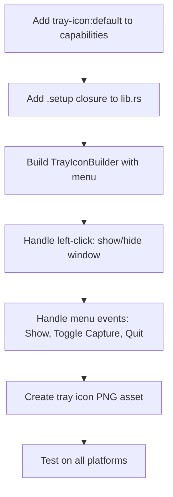
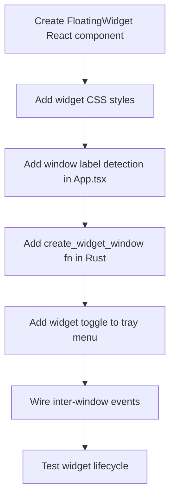

# System Tray & Floating Widget Feature Proposal

## Overview

AudioGraph is a Tauri v2 desktop application (Rust backend + React frontend) for real-time audio capture, transcription, and knowledge graph construction. During active capture sessions, users need the app running but don't always need the full UI visible. This proposal defines **three window management behaviors** that give users control over how AudioGraph presents itself:

| Mode | Description | Use Case |
|------|-------------|----------|
| **1. Minimize to Taskbar** | Default OS minimize behavior | Quick switch away, standard workflow |
| **2. Minimize to System Tray** | Window hides; tray icon with context menu persists | Long-running capture sessions, reduced taskbar clutter |
| **3. Floating Widget** | Compact always-on-top mini-window with essential controls | Monitor capture while working in other apps |

All three modes are complementary — tray icon support is a prerequisite for the floating widget, and the taskbar mode requires zero changes. The user can switch between modes freely via the tray context menu or a global hotkey.

### Current State

- **App identifier**: `com.rsac.audiograph`
- **Tauri version**: `2.10.3`
- **Main window**: 1400×900, resizable, defined in [`tauri.conf.json`](../src-tauri/tauri.conf.json:13)
- **Entry point**: [`lib.rs`](../src-tauri/src/lib.rs:28) — `tauri::Builder::default()` with `.manage()` and `.invoke_handler()`
- **Capabilities**: [`default.json`](../src-tauri/capabilities/default.json:1) — only `core:default` currently
- **No plugins registered** — no `.plugin()` calls in the current builder chain

---

## Mode 1: Minimize to Taskbar — Default

### Current Behavior

This is the standard Tauri/OS window management behavior that works out of the box:

- **Windows**: Clicking the minimize button (or `Win+D`) sends the window to the taskbar. The AudioGraph icon remains visible in the taskbar. Clicking the taskbar icon restores the window.
- **macOS**: Clicking the yellow minimize button (or `Cmd+M`) sends the window to the Dock with a genie/scale animation. Clicking the Dock icon restores it.
- **Linux**: Clicking minimize sends the window to the taskbar/panel. Behavior depends on the desktop environment (GNOME, KDE, etc.).

### Implementation

**No code changes required.** This behavior is provided by the operating system and Tauri's default window configuration.

The current window definition in [`tauri.conf.json`](../src-tauri/tauri.conf.json:13):

```json
{
    "app": {
        "windows": [
            {
                "title": "AudioGraph",
                "width": 1400,
                "height": 900,
                "resizable": true,
                "fullscreen": false
            }
        ]
    }
}
```

Audio capture continues running in the background when minimized because the Tauri backend (Rust) runs independently of window visibility. The `rsac` library's capture thread and ring buffer bridge operate on separate threads unaffected by window state.

---

## Mode 2: Minimize to System Tray

### Overview

Instead of minimizing to the taskbar, the main window **hides completely** and a **system tray icon** appears with a context menu. This is ideal for long-running capture sessions where the user wants AudioGraph running but not consuming taskbar space.

The tray icon provides:
- **Left-click**: Show/hide the main window
- **Right-click**: Context menu with Show/Hide, Start/Stop Capture, and Quit

### Implementation Approach

1. Add `tauri-plugin-tray-icon` (bundled with Tauri v2 core — no separate crate needed)
2. Build a `TrayIcon` with context menu in the `.setup()` closure of [`lib.rs`](../src-tauri/src/lib.rs:28)
3. Intercept the window close event to hide instead of quit (optional — prevents accidental exit)
4. Add `"tray-icon:default"` to capabilities

### Tauri Plugins Required

In Tauri v2, the tray icon API is **built into the core `tauri` crate** — it lives in `tauri::tray` and `tauri::menu`. No additional Cargo dependency is needed beyond the existing `tauri = "2.10.3"`.

The relevant modules:
- `tauri::tray::{TrayIconBuilder, TrayIconEvent, MouseButton, MouseButtonState}`
- `tauri::menu::{MenuBuilder, MenuItemBuilder}`
- `tauri::Manager` (for `get_webview_window()`)

### Rust Code — Key Snippets

The tray setup goes inside a `.setup()` closure added to the builder in [`lib.rs`](../src-tauri/src/lib.rs:33):

```rust
use tauri::tray::{TrayIconBuilder, MouseButton, MouseButtonState, TrayIconEvent};
use tauri::menu::{MenuBuilder, MenuItemBuilder};
use tauri::Manager;

// In lib.rs run() function, modify the builder:
tauri::Builder::default()
    .manage(app_state)
    .setup(|app| {
        // Build context menu items
        let show_item = MenuItemBuilder::with_id("show", "Show AudioGraph").build(app)?;
        let start_item = MenuItemBuilder::with_id("toggle_capture", "Start Capture").build(app)?;
        let quit_item = MenuItemBuilder::with_id("quit", "Quit").build(app)?;

        let menu = MenuBuilder::new(app)
            .items(&[&show_item, &start_item, &quit_item])
            .build()?;

        // Build the tray icon
        let _tray = TrayIconBuilder::new("main-tray")
            .menu(&menu)
            .icon(app.default_window_icon().unwrap().clone())
            .on_tray_icon_event(|tray, event| {
                if let TrayIconEvent::Click {
                    button: MouseButton::Left,
                    button_state: MouseButtonState::Up,
                    ..
                } = event
                {
                    let app = tray.app_handle();
                    if let Some(window) = app.get_webview_window("main") {
                        let _ = window.unminimize();
                        let _ = window.show();
                        let _ = window.set_focus();
                    }
                }
            })
            .on_menu_event(|app, event| {
                match event.id().as_ref() {
                    "show" => {
                        if let Some(window) = app.get_webview_window("main") {
                            let _ = window.unminimize();
                            let _ = window.show();
                            let _ = window.set_focus();
                        }
                    }
                    "toggle_capture" => {
                        // TODO: Emit event to toggle capture state
                        // app.emit("toggle-capture", ()).ok();
                    }
                    "quit" => app.exit(0),
                    _ => {}
                }
            })
            .build()?;

        Ok(())
    })
    .invoke_handler(tauri::generate_handler![
        // ... existing command handlers ...
    ])
    .run(tauri::generate_context!())
    .expect("error while running AudioGraph");
```

### Frontend Changes

To hide the window to tray on minimize (instead of standard minimize), add a window event listener in the React frontend:

```typescript
// src/hooks/useTrayMinimize.ts
import { getCurrentWindow } from '@tauri-apps/api/window';

export function useTrayMinimize() {
    const window = getCurrentWindow();

    // Listen for the close-requested event to hide instead of close
    window.onCloseRequested(async (event) => {
        event.preventDefault();
        await window.hide();
    });
}
```

Alternatively, the "minimize to tray" behavior can be triggered by a custom button in the UI rather than overriding the native minimize/close behavior.

### Capability Permissions

Update [`capabilities/default.json`](../src-tauri/capabilities/default.json:1) to include tray icon permissions:

```json
{
    "$schema": "../gen/schemas/desktop-schema.json",
    "identifier": "default",
    "description": "Capability for the main window",
    "windows": [
        "main"
    ],
    "permissions": [
        "core:default",
        "tray-icon:default"
    ]
}
```

### Tray Icon Asset

A PNG icon is required for the tray. Recommended specifications:
- **Format**: PNG with alpha transparency
- **Sizes**: 32×32 (Windows/Linux) and 22×22 or 44×44 @2x (macOS menu bar)
- **Location**: `src-tauri/icons/tray-icon.png`
- The icon can be set via `.icon()` on `TrayIconBuilder`, or `app.default_window_icon()` reuses the app icon

### Platform-Specific Considerations

| Platform | Location | Behavior | Notes |
|----------|----------|----------|-------|
| **Windows** | Notification area (bottom-right, system tray) | Native support. Icon appears immediately. Left-click + right-click both work. | May need "Show hidden icons" arrow if tray is full |
| **macOS** | Menu bar (top-right) | Native support via NSStatusItem. Icon appears in menu bar area. | Template images recommended (monochrome, system adapts to dark/light mode). `menuOnLeftClick` can unify left/right click behavior. |
| **Linux** | Desktop environment dependent | **KDE Plasma**: Native support via StatusNotifierItem. **GNOME**: Requires `AppIndicator` extension (e.g., `libappindicator3` or GNOME Shell extension). **Other DEs**: Varies. | Install `libayatana-appindicator3-dev` or `libappindicator3-dev` on Debian/Ubuntu for build support |

---

## Mode 3: Floating Widget

### Overview

A small, always-on-top, borderless window that shows essential capture controls: status indicator, start/stop button, and elapsed time. The widget allows users to monitor and control AudioGraph while working in other applications without needing the full 1400×900 main window.

### Implementation Approach

1. Create a second Tauri window at runtime using `WebviewWindowBuilder`
2. The widget loads the same React app but renders a dedicated widget route/component
3. Communication between the main window and widget uses Tauri's event system
4. Toggle between main window ↔ widget via tray menu or global hotkey

### Window Configuration

The widget window is created dynamically (not in `tauri.conf.json`) because it only appears on demand:

```rust
use tauri::WebviewWindowBuilder;
use tauri::WebviewUrl;

fn create_widget_window(app: &tauri::AppHandle) -> Result<(), Box<dyn std::error::Error>> {
    let _widget = WebviewWindowBuilder::new(
        app,
        "widget",
        WebviewUrl::App("index.html".into()),
    )
    .title("AudioGraph Widget")
    .inner_size(300.0, 80.0)
    .always_on_top(true)
    .decorations(false)
    .resizable(false)
    .skip_taskbar(true)
    .transparent(true)
    .build()?;
    Ok(())
}

fn close_widget_window(app: &tauri::AppHandle) {
    if let Some(widget) = app.get_webview_window("widget") {
        let _ = widget.close();
    }
}
```

Key window properties:

| Property | Value | Purpose |
|----------|-------|---------|
| `inner_size` | 300×80 | Compact footprint |
| `always_on_top` | `true` | Stays visible over other windows |
| `decorations` | `false` | No title bar or window chrome |
| `resizable` | `false` | Fixed size widget |
| `skip_taskbar` | `true` | Does not appear in taskbar (Windows/Linux) |
| `transparent` | `true` | Allows rounded corners and custom shapes |

### Widget UI Design

The widget React component renders a minimal control surface:

```
┌─────────────────────────────────────────────┐
│  🔴 Recording   00:05:32   │ ⏹ │ ✕ │ ⬆ │  │
└─────────────────────────────────────────────┘
 Status indicator │ Timer │ Stop │ Close │ Expand
```

Elements:
- **Status indicator**: Red dot (recording) / gray dot (idle) / yellow dot (paused)
- **Timer**: Elapsed capture time (HH:MM:SS)
- **Stop/Start button**: Toggle capture
- **Close button**: Close widget, return to minimized/tray state
- **Expand button**: Close widget, show main window

### Widget React Component

The widget detects it's in the "widget" window by checking the Tauri window label:

```typescript
// src/components/FloatingWidget.tsx
import { useState, useEffect } from 'react';
import { getCurrentWindow } from '@tauri-apps/api/window';
import { emit, listen } from '@tauri-apps/api/event';

interface CaptureState {
    isCapturing: boolean;
    elapsed: number; // seconds
}

export function FloatingWidget() {
    const [state, setState] = useState<CaptureState>({
        isCapturing: false,
        elapsed: 0,
    });

    useEffect(() => {
        // Listen for capture state updates from the main window / backend
        const unlisten = listen<CaptureState>('capture-state-update', (event) => {
            setState(event.payload);
        });
        return () => { unlisten.then(fn => fn()); };
    }, []);

    const toggleCapture = async () => {
        await emit('toggle-capture', {});
    };

    const expandToMain = async () => {
        await emit('show-main-window', {});
        await getCurrentWindow().close();
    };

    const closeWidget = async () => {
        await getCurrentWindow().close();
    };

    const formatTime = (seconds: number) => {
        const h = Math.floor(seconds / 3600).toString().padStart(2, '0');
        const m = Math.floor((seconds % 3600) / 60).toString().padStart(2, '0');
        const s = (seconds % 60).toString().padStart(2, '0');
        return `${h}:${m}:${s}`;
    };

    return (
        <div className="widget-container">
            <div className={`status-dot ${state.isCapturing ? 'recording' : 'idle'}`} />
            <span className="status-text">
                {state.isCapturing ? 'Recording' : 'Idle'}
            </span>
            <span className="timer">{formatTime(state.elapsed)}</span>
            <button onClick={toggleCapture}>
                {state.isCapturing ? '⏹' : '▶'}
            </button>
            <button onClick={closeWidget}>✕</button>
            <button onClick={expandToMain}>⬆</button>
        </div>
    );
}
```

#### Widget CSS

```css
/* src/styles/widget.css */
.widget-container {
    display: flex;
    align-items: center;
    gap: 8px;
    padding: 8px 16px;
    background: rgba(30, 30, 30, 0.95);
    border-radius: 12px;
    color: white;
    font-family: -apple-system, BlinkMacSystemFont, 'Segoe UI', sans-serif;
    font-size: 13px;
    /* Enable dragging the widget window */
    -webkit-app-region: drag;
    user-select: none;
    height: 80px;
    width: 300px;
    box-sizing: border-box;
}

.widget-container button {
    -webkit-app-region: no-drag; /* Buttons must be clickable, not draggable */
    background: rgba(255, 255, 255, 0.1);
    border: none;
    color: white;
    padding: 4px 8px;
    border-radius: 6px;
    cursor: pointer;
}

.status-dot {
    width: 10px;
    height: 10px;
    border-radius: 50%;
}

.status-dot.recording { background: #ff3b30; animation: pulse 1.5s infinite; }
.status-dot.idle { background: #8e8e93; }

@keyframes pulse {
    0%, 100% { opacity: 1; }
    50% { opacity: 0.5; }
}
```

#### App Routing for Widget

In [`App.tsx`](../src/App.tsx), detect the window label to render either the full app or the widget:

```typescript
// src/App.tsx
import { getCurrentWindow } from '@tauri-apps/api/window';
import { useState, useEffect } from 'react';
import { FloatingWidget } from './components/FloatingWidget';
// ... existing imports ...

function App() {
    const [isWidget, setIsWidget] = useState(false);

    useEffect(() => {
        getCurrentWindow().label.then
        // Synchronous check: Tauri window labels are available immediately
        const label = getCurrentWindow().label;
        setIsWidget(label === 'widget');
    }, []);

    if (isWidget) {
        return <FloatingWidget />;
    }

    // ... existing full app JSX ...
}
```

### Communication Between Windows

Tauri's event system enables bidirectional communication:

```
┌──────────────┐    emit/listen     ┌──────────────┐
│  Main Window │ ◄───────────────► │    Widget     │
│   - label:   │                    │   - label:    │
│     main     │                    │     widget    │
└──────┬───────┘                    └──────┬───────┘
       │                                   │
       │        Tauri Events               │
       │   capture-state-update            │
       │   toggle-capture                  │
       │   show-main-window                │
       └───────────┬───────────────────────┘
                   │
           ┌───────▼───────┐
           │  Rust Backend  │
           │  AppState      │
           │  Audio Pipeline │
           └───────────────┘
```

**Event flow:**
1. The Rust backend emits `capture-state-update` to all windows when capture state changes
2. Either window can emit `toggle-capture` which the Rust backend listens for
3. The widget emits `show-main-window` when the expand button is clicked; the Rust backend shows the main window and closes the widget

Backend event listener in Rust:

```rust
// In setup() closure:
let app_handle = app.handle().clone();
app.listen("show-main-window", move |_event| {
    if let Some(main) = app_handle.get_webview_window("main") {
        let _ = main.unminimize();
        let _ = main.show();
        let _ = main.set_focus();
    }
    if let Some(widget) = app_handle.get_webview_window("widget") {
        let _ = widget.close();
    }
});
```

### Hotkey Registration

The `tauri-plugin-global-shortcut` plugin enables system-wide keyboard shortcuts, even when AudioGraph is not focused.

**Cargo dependency** — add to [`Cargo.toml`](../src-tauri/Cargo.toml):

```toml
[dependencies]
tauri-plugin-global-shortcut = "2"
```

**Capability permission** — add to [`capabilities/default.json`](../src-tauri/capabilities/default.json):

```json
{
    "permissions": [
        "core:default",
        "tray-icon:default",
        "global-shortcut:allow-register",
        "global-shortcut:allow-unregister"
    ]
}
```

**Rust setup** — register the plugin and shortcuts in [`lib.rs`](../src-tauri/src/lib.rs):

```rust
use tauri_plugin_global_shortcut::{GlobalShortcutExt, Shortcut, ShortcutState};

tauri::Builder::default()
    .plugin(
        tauri_plugin_global_shortcut::Builder::new()
            .with_handler(|app, shortcut, event| {
                if event.state() == ShortcutState::Pressed {
                    let shortcut_str = shortcut.to_string();
                    match shortcut_str.as_str() {
                        // Toggle main window ↔ floating widget
                        "CmdOrCtrl+Shift+G" => {
                            if let Some(main) = app.get_webview_window("main") {
                                if main.is_visible().unwrap_or(false) {
                                    let _ = main.hide();
                                    create_widget_window(app).ok();
                                } else {
                                    let _ = main.unminimize();
                                    let _ = main.show();
                                    let _ = main.set_focus();
                                    close_widget_window(app);
                                }
                            }
                        }
                        // Toggle capture start/stop
                        "CmdOrCtrl+Shift+S" => {
                            app.emit("toggle-capture", ()).ok();
                        }
                        _ => {}
                    }
                }
            })
            .build(),
    )?;

// After .run() or in .setup():
app.global_shortcut().register("CmdOrCtrl+Shift+G")?;
app.global_shortcut().register("CmdOrCtrl+Shift+S")?;
```

**Recommended global shortcuts:**

| Shortcut | Action |
|----------|--------|
| `CmdOrCtrl+Shift+G` | Toggle between main window and floating widget |
| `CmdOrCtrl+Shift+S` | Toggle capture start/stop |

> **Note**: `CmdOrCtrl` maps to `Cmd` on macOS and `Ctrl` on Windows/Linux.

### Widget Window Capabilities

The widget window needs its own capabilities entry since it's a separate window label. Update [`capabilities/default.json`](../src-tauri/capabilities/default.json):

```json
{
    "$schema": "../gen/schemas/desktop-schema.json",
    "identifier": "default",
    "description": "Capabilities for AudioGraph windows",
    "windows": [
        "main",
        "widget"
    ],
    "permissions": [
        "core:default",
        "tray-icon:default",
        "global-shortcut:allow-register",
        "global-shortcut:allow-unregister"
    ]
}
```

### Platform-Specific Considerations

| Feature | Windows | macOS | Linux |
|---------|---------|-------|-------|
| Always-on-top | ✅ Native | ✅ Native (NSWindow level) | ✅ Native (X11/Wayland) |
| Borderless/decorations off | ✅ | ✅ | ✅ |
| Transparent background | ✅ (DWM composition) | ✅ (NSWindow) | ⚠️ Requires compositor (Wayland/X11 composite) |
| Skip taskbar | ✅ | ❌ Unsupported on macOS | ✅ |
| Drag by CSS region | ✅ | ✅ | ⚠️ Wayland may not support `-webkit-app-region` |
| Window shadow | Auto with decorations | Auto with decorations | DE-dependent |

**macOS-specific notes:**
- `skip_taskbar` is unsupported on macOS — the Dock icon always shows
- Consider using `NSPanel` behavior (via Tauri's window type) for a proper floating panel
- Accessibility permissions may be needed for global shortcuts

**Linux-specific notes:**
- Transparent windows require a compositor (most modern DEs have one)
- Wayland has restrictions on always-on-top and window positioning
- Some tiling window managers may ignore `always_on_top`

---

## Tauri APIs & Plugins Summary

| Plugin / API | Crate | Version | Purpose | New Dependency? |
|--------------|-------|---------|---------|----------------|
| `tauri::tray` | `tauri` | 2.10.3 | System tray icon + context menu | No (built-in) |
| `tauri::menu` | `tauri` | 2.10.3 | Menu building for tray context menu | No (built-in) |
| `tauri::WebviewWindowBuilder` | `tauri` | 2.10.3 | Create floating widget window at runtime | No (built-in) |
| `tauri::Manager` | `tauri` | 2.10.3 | Access windows by label | No (built-in) |
| `tauri-plugin-global-shortcut` | `tauri-plugin-global-shortcut` | 2.x | System-wide keyboard shortcuts | **Yes** |
| `@tauri-apps/api/window` | npm | 2.x | Frontend window API | Already available |
| `@tauri-apps/api/event` | npm | 2.x | Frontend event emit/listen | Already available |
| `@tauri-apps/plugin-global-shortcut` | npm | 2.x | Frontend shortcut registration | **Yes** (optional) |

---

## Implementation Phases

### Phase A: System Tray Icon (Mode 2)



**Steps:**
1. Update [`capabilities/default.json`](../src-tauri/capabilities/default.json) — add `"tray-icon:default"`
2. Add `.setup()` closure to [`lib.rs`](../src-tauri/src/lib.rs) builder chain
3. Build `TrayIconBuilder` with context menu (Show, Toggle Capture, Quit)
4. Wire `on_tray_icon_event` for left-click show/focus
5. Wire `on_menu_event` for menu item actions
6. Create/add tray icon PNG (32×32 and/or 22×22 for macOS)
7. Test: Windows notification area, macOS menu bar, Linux (KDE + GNOME)

### Phase B: Floating Widget (Mode 3)



**Steps:**
1. Create `FloatingWidget.tsx` component with status, timer, controls
2. Add widget CSS with draggable region and dark semi-transparent background
3. Modify [`App.tsx`](../src/App.tsx) to detect `widget` window label and render widget UI
4. Add `create_widget_window()` and `close_widget_window()` functions to Rust backend
5. Add "Show Widget" item to tray context menu
6. Wire `capture-state-update`, `toggle-capture`, `show-main-window` events
7. Add `"widget"` to capabilities window list
8. Test: creation, destruction, always-on-top, drag behavior, cross-window events

### Phase C: Global Shortcuts (Enhancement for Mode 3)

**Steps:**
1. Add `tauri-plugin-global-shortcut = "2"` to [`Cargo.toml`](../src-tauri/Cargo.toml)
2. Add shortcut permissions to capabilities
3. Register `.plugin()` with handler in [`lib.rs`](../src-tauri/src/lib.rs)
4. Register `CmdOrCtrl+Shift+G` (toggle widget) and `CmdOrCtrl+Shift+S` (toggle capture)
5. Test: shortcuts work when app is not focused, no conflicts with other apps
6. Add user-configurable shortcut support (future enhancement)

---

## Code Snippets

### Tray Icon Setup — Rust

Complete tray icon setup for [`lib.rs`](../src-tauri/src/lib.rs):

```rust
use tauri::tray::{TrayIconBuilder, MouseButton, MouseButtonState, TrayIconEvent};
use tauri::menu::{MenuBuilder, MenuItemBuilder};
use tauri::Manager;

pub fn run() {
    env_logger::init();

    let app_state = AppState::new();

    tauri::Builder::default()
        .manage(app_state)
        .setup(|app| {
            // --- System Tray ---
            let show_item = MenuItemBuilder::with_id("show", "Show AudioGraph").build(app)?;
            let hide_item = MenuItemBuilder::with_id("hide", "Hide AudioGraph").build(app)?;
            let separator = tauri::menu::PredefinedMenuItem::separator(app)?;
            let start_item = MenuItemBuilder::with_id("toggle_capture", "Start Capture").build(app)?;
            let widget_item = MenuItemBuilder::with_id("show_widget", "Show Widget").build(app)?;
            let separator2 = tauri::menu::PredefinedMenuItem::separator(app)?;
            let quit_item = MenuItemBuilder::with_id("quit", "Quit AudioGraph").build(app)?;

            let menu = MenuBuilder::new(app)
                .items(&[
                    &show_item,
                    &hide_item,
                    &separator,
                    &start_item,
                    &widget_item,
                    &separator2,
                    &quit_item,
                ])
                .build()?;

            let _tray = TrayIconBuilder::new("main-tray")
                .tooltip("AudioGraph")
                .menu(&menu)
                .icon(app.default_window_icon().unwrap().clone())
                .on_tray_icon_event(|tray, event| {
                    if let TrayIconEvent::Click {
                        button: MouseButton::Left,
                        button_state: MouseButtonState::Up,
                        ..
                    } = event
                    {
                        let app = tray.app_handle();
                        if let Some(window) = app.get_webview_window("main") {
                            if window.is_visible().unwrap_or(false) {
                                let _ = window.hide();
                            } else {
                                let _ = window.unminimize();
                                let _ = window.show();
                                let _ = window.set_focus();
                            }
                        }
                    }
                })
                .on_menu_event(|app, event| {
                    match event.id().as_ref() {
                        "show" => {
                            if let Some(window) = app.get_webview_window("main") {
                                let _ = window.unminimize();
                                let _ = window.show();
                                let _ = window.set_focus();
                            }
                        }
                        "hide" => {
                            if let Some(window) = app.get_webview_window("main") {
                                let _ = window.hide();
                            }
                        }
                        "toggle_capture" => {
                            app.emit("toggle-capture", ()).ok();
                        }
                        "show_widget" => {
                            if let Some(main) = app.get_webview_window("main") {
                                let _ = main.hide();
                            }
                            create_widget_window(app).ok();
                        }
                        "quit" => app.exit(0),
                        _ => {}
                    }
                })
                .build()?;

            Ok(())
        })
        .invoke_handler(tauri::generate_handler![
            commands::list_audio_sources,
            commands::start_capture,
            commands::stop_capture,
            commands::get_graph_snapshot,
            commands::get_transcript,
            commands::get_pipeline_status,
            commands::send_chat_message,
            commands::get_chat_history,
            commands::clear_chat_history,
            commands::list_available_models,
            commands::download_model_cmd,
            commands::configure_api_endpoint,
        ])
        .run(tauri::generate_context!())
        .expect("error while running AudioGraph");
}
```

### Widget Window Creation — Rust

```rust
use tauri::WebviewWindowBuilder;
use tauri::WebviewUrl;
use tauri::Manager;

fn create_widget_window(app: &tauri::AppHandle) -> Result<(), Box<dyn std::error::Error>> {
    // Don't create if already exists
    if app.get_webview_window("widget").is_some() {
        return Ok(());
    }

    let _widget = WebviewWindowBuilder::new(
        app,
        "widget",
        WebviewUrl::App("index.html".into()),
    )
    .title("AudioGraph Widget")
    .inner_size(300.0, 80.0)
    .always_on_top(true)
    .decorations(false)
    .resizable(false)
    .skip_taskbar(true)
    .transparent(true)
    .build()?;

    Ok(())
}

fn close_widget_window(app: &tauri::AppHandle) {
    if let Some(widget) = app.get_webview_window("widget") {
        let _ = widget.close();
    }
}
```

### Widget React Component — TypeScript

See the `FloatingWidget.tsx` component in the **Widget UI Design** section above.

### Hotkey Registration — Rust

```rust
use tauri_plugin_global_shortcut::{GlobalShortcutExt, ShortcutState};

// Add to the builder chain before .run():
.plugin(
    tauri_plugin_global_shortcut::Builder::new()
        .with_handler(|app, shortcut, event| {
            if event.state() == ShortcutState::Pressed {
                let shortcut_str = shortcut.to_string();
                match shortcut_str.as_str() {
                    "CmdOrCtrl+Shift+G" => toggle_widget(app),
                    "CmdOrCtrl+Shift+S" => {
                        app.emit("toggle-capture", ()).ok();
                    }
                    _ => {}
                }
            }
        })
        .build(),
)?
```

### Window Toggle Logic — Rust

```rust
fn toggle_widget(app: &tauri::AppHandle) {
    let widget_exists = app.get_webview_window("widget").is_some();

    if widget_exists {
        // Widget shown → switch to main window
        close_widget_window(app);
        if let Some(main) = app.get_webview_window("main") {
            let _ = main.unminimize();
            let _ = main.show();
            let _ = main.set_focus();
        }
    } else {
        // Main window shown → switch to widget
        if let Some(main) = app.get_webview_window("main") {
            let _ = main.hide();
        }
        create_widget_window(app).ok();
    }
}
```

---

## Platform Compatibility Matrix

| Feature | Windows | macOS | Linux (KDE) | Linux (GNOME) | Linux (Wayland) |
|---------|---------|-------|-------------|--------------|-----------------|
| System tray icon | ✅ | ✅ (menu bar) | ✅ | ⚠️ Needs extension | ⚠️ Needs extension |
| Tray context menu | ✅ | ✅ | ✅ | ⚠️ | ⚠️ |
| Tray left-click event | ✅ | ✅ | ✅ | ⚠️ | ⚠️ |
| Floating widget (always-on-top) | ✅ | ✅ | ✅ | ✅ | ⚠️ Compositor-dependent |
| Transparent widget | ✅ | ✅ | ✅ (X11 + compositor) | ✅ | ✅ |
| Skip taskbar (widget) | ✅ | ❌ | ✅ | ✅ | ⚠️ |
| CSS drag region | ✅ | ✅ | ✅ (X11) | ✅ (X11) | ❌ Limited |
| Global shortcuts | ✅ | ✅ | ✅ (X11) | ✅ (X11) | ⚠️ Limited |
| Window hide/show | ✅ | ✅ | ✅ | ✅ | ✅ |

**Legend:** ✅ = Works natively | ⚠️ = Works with caveats | ❌ = Not supported

### Linux Notes
- **GNOME**: System tray support removed in GNOME 3.26. Users need the [AppIndicator extension](https://extensions.gnome.org/extension/615/appindicator-support/) or equivalent. Build requires `libayatana-appindicator3-dev`.
- **KDE Plasma**: Full native tray support via StatusNotifierItem protocol.
- **Wayland**: Global shortcuts require the `org_kde_plasma_window_management` or XDG portal protocol. X11 fallback (XWayland) works more reliably. Window positioning and always-on-top may behave differently.

---

## Open Questions

1. **Close-to-tray vs. minimize-to-tray**: Should the window close button (✕) hide to tray, or should only an explicit menu/button trigger tray hide? Overriding close can confuse users.

2. **Widget position persistence**: Should the widget remember its last position on screen? This requires storing coordinates in app state or local config.

3. **Widget drag behavior on Wayland**: CSS `-webkit-app-region: drag` may not work on Wayland. Consider implementing drag via mouse event handlers as a fallback.

4. **Multiple monitors**: When the widget is always-on-top, which monitor should it appear on? Default to the primary monitor or follow the main window's last position?

5. **Tray icon on Linux CI**: The CI runs on Linux with PipeWire in Docker. Tray icon tests will need to be skipped or mocked in headless environments.

6. **Global shortcut conflicts**: `CmdOrCtrl+Shift+G` and `CmdOrCtrl+Shift+S` may conflict with other applications. Should shortcuts be user-configurable from a settings UI?

7. **macOS menu bar icon style**: Should the tray icon be a template image (monochrome, adapts to system appearance) or a full-color icon?

8. **Widget on macOS Dock**: Since `skip_taskbar` is unsupported on macOS, the widget will show in the Dock. Is this acceptable, or should an alternative approach (LSUIElement/NSPanel) be investigated?

9. **Tray menu capture state sync**: The "Start Capture" / "Stop Capture" menu item text should update dynamically based on capture state. This requires holding a reference to the menu item and calling `.set_text()`.

10. **Resource cleanup**: When the widget is closed, should we explicitly clean up the window and free resources, or does Tauri handle this automatically via the Close event?
